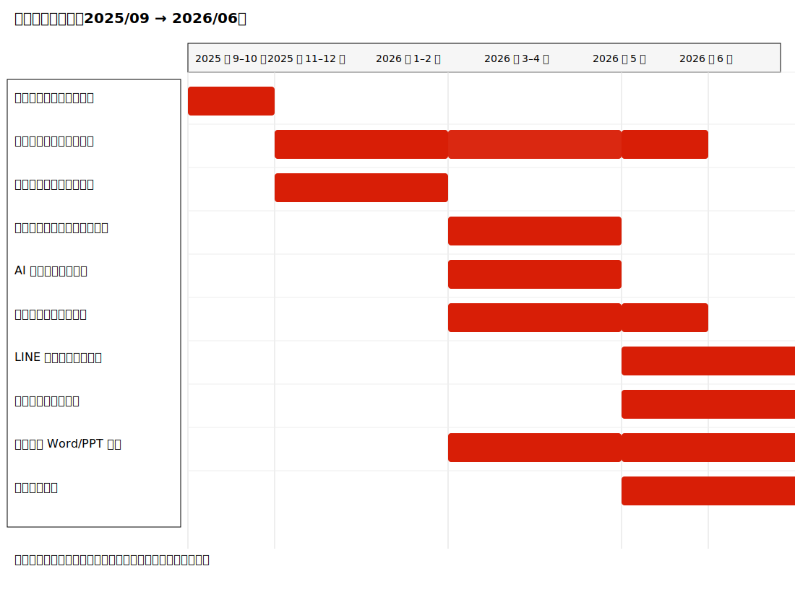

# 專題進度報告

日期：2026年6月14日

## 前言

本進度報告彙整截至目前為止之系統開發進度、已完成之功能、測試概況與下一步計畫。內容已依系統新功能（情境感知、向量檢索、動態行程調整與 LINE 推播）進行更新，便於指導老師或專案組員快速掌握專案現況與後續重點。

### 一、專題目標（修訂）

本專題旨在開發一套具備智慧分析、自動化規劃與高互動性之「智慧旅遊行程規劃系統」，針對使用者於旅遊規劃時常見之景點安排困難、時間衝突、交通規劃不易，以及無法依個人偏好快速產生行程等問題，結合 AI 分析、資料處理與前後端整合技術，建立一套可自動生成個人化旅遊行程之智慧旅遊平台。具體工程目標如下：

(一) 建立智慧旅遊推薦與行程規劃系統：使用者可輸入旅遊城市、日期、出發地點與旅遊偏好等資訊，系統將自動分析需求並產生可行的旅遊行程，提供景點順序安排、停留時間建議與路線規劃，降低使用者自行規劃行程之負擔。

(二) 建立 AI 景點分析與分類功能：透過 TF‑IDF 與 LinearSVC 等機器學習方法，分析景點描述、標籤與評論內容，建立景點分類機制，自動辨識自然景觀、文化景點、美食餐廳與休閒娛樂等類別，以提升推薦準確度與篩選效率。

(三) 建構時間感知排序與停留時間估算機制：系統將以景點距離、交通時間、營業時間、景點人氣與使用者偏好等因素建立景點成本模型（Cost Function），並依據景點類型、評論數與旅遊目的估算合理停留時間，自動調整景點安排順序以避免營業時間衝突或行程過度緊湊。

(四) 建立即時情境感知與動態行程調整功能：系統將結合使用者位置、時間、天氣、景點營業狀態與周邊資訊建立即時情境感知（Context‑Aware）機制，當發生天氣變化、景點暫停營業或時間不足等情況時，能即時調整推薦景點與行程安排，提升行程彈性與可執行性。

(五) 建立即時通知與 LINE 推播功能：系統整合 LINE Notify / Messaging API 與推播機制，於行程開始前或行程執行期間自動推送景點資訊、行程提醒與交通建議；透過主動推播即便使用者未開啟應用，也能即時收到重要旅遊資訊，提高系統互動性與使用便利性。

以上目標將作為後續系統設計、驗證測試與績效評估之依據。

## 二、 專題進度

(一) 景點資料蒐集與資料庫建置：
目前已完成部分旅遊景點資料之蒐集，透過 Google Places API 與自建網路爬蟲，自動擷取景點名稱、經緯度、類別、評分、營業時間與使用者評論等欄位，並匯入專案資料庫。所蒐集資料已進行文字清理、欄位標準化、初步標籤整理與分類，以提升後續 AI 模型訓練與檢索之資料品質。

(二) AI 景點分類模型建置：
已完成 AI 分類模型之初步建置與驗證，採用 TF‑IDF 作為文字特徵、搭配 LinearSVC 進行分類，能將景點劃分為自然景觀、文化景點、美食餐廳、休閒娛樂、夜市商圈等類別。已以現有景點資料進行交叉驗證並產出初步指標，後續計畫擴充標註集以提升準確性與召回率。

(三) 智慧行程規劃與成本模型設計：
完成行程規劃流程之設計與雛形實作，系統會依據景點間距離、預估交通時間、營業時間窗、景點人氣與使用者偏好等因素建立景點選擇成本函數（Cost Function），自動判斷景點安排順序與行程可行性。同時已啟動停留時間估算規則之建置，以使產出行程更接近實際旅遊需求。

(四) 即時情境感知功能建置（進行中）：
正在整合天氣資料、景點營業狀態、時間條件與使用者定位資訊，開發情境權重引擎以於行程執行期間動態調整候選景點與排序。當遇到天候變化、臨時休館或時間不足等狀況時，系統可即時更新推薦結果以保持行程彈性與實用性，目前功能仍處於整合測試與參數微調階段。

(五) LINE 推播與通知功能（進行中）：
已規劃並開始實作 LINE Notify / Messaging API 之整合，能於行程開始前或旅遊過程中主動推送景點資訊、行程提醒與即時推薦。後續將加入互動按鈕（例如接受、拒絕或微調）與推播頻率管理，以提升使用者互動與避免過度推播。

(六) 前端介面設計與系統整合（持續進行）：
完成部分 Figma UI/UX 設計稿，包含登入、偏好設定、景點推薦與行程編輯等畫面；並已開始以 Flutter 實作前端示範介面，進行與後端 API 之串接測試，以優化使用流程與操作體驗。未來若新增功能，前端頁面將同步更新與驗證。

以上為本專題「二、專題進度」之最新調整，內容格式與條列架構已依您提供稿件整理並潤飾語句。如需我同時把此段落更新至報告之 PDF 檔內，或產出英文版，請告知下一步要我執行的動作。

## 三、 專題預期成果

本專題預期交付一套可部署之智慧旅遊行程規劃系統，包含後端服務與向量索引與 embedding pipeline、已訓練且可復現之景點分類模型與標註資料、召回與排序之智慧行程規劃模組（含成本函數與停留時間估算）、即時情境感知整合範例、LINE 推播整合實作、以及 Flutter 示範前端並附上完整 OpenAPI 文件，並同步提供分類與檢索之測試報告（準確率/召回率、Recall@K）、API 延遲與負載測試摘要，以及成果簡報（Word/PPT）供展示與部署參考。

## 四、 進度甘特圖

下圖為本專題時程甘特圖（2025/09 → 2026/06），紅色區塊標示主要開發或推進時段：

備註：若需輸出為 PNG 或內嵌至原始 PDF，我可依您指定的解析度（如 1200x900 px 或 300 DPI）產出對應檔案或協助回寫 PDF。

## 三、 專題預期成果

本專題預期完成一套可協助使用者快速產生個人化旅遊行程之「智慧旅遊行程規劃系統」。使用者僅需輸入目的地、日期與偏好，系統即可自動產生符合條件的行程建議，包含景點順序、停留時間與路線規劃，減少自行查找與手動安排的時間成本。

系統亦將支援情境感知與動態調整：根據天氣、營業時間、交通狀況與使用者即時位置，自動更新推薦內容與行程安排，提升可執行性與彈性。此外，透過 LINE 推播提醒與互動按鈕，使用者可即時接收提醒並快速回饋，促進推薦策略的持續優化。

整體交付物預期包含：1) 可部署之後端服務與向量索引配置；2) 已訓練之分類模型與 embedding pipeline；3) 前端示範介面（Flutter）與 API 文件（OpenAPI）；4) 測試結果報告與部署說明。最終目標為提供一套兼具智慧化、實用性與易用性的旅遊規劃平台，提升使用者規劃效率與旅遊體驗。

## 製作理論探討（摘要）

- 推薦流程：採兩階段召回（embedding + 類別過濾）與排序（線性加權或 learning‑to‑rank）策略，兼顧相關性與可行性。
- 特徵工程：以 TF‑IDF 為核心文字特徵，必要時結合 sentence embedding 作語意補強，分類器以 LinearSVC 處理高維稀疏特徵。
- 情境感知：以情境權重引擎對候選分數進行動態調整（如雨天降低戶外景點分數、晚間過濾日間營業景點）。
- 路線最佳化：在同日行程中使用啟發式 TSP 方法（例如 2‑opt）並考量營業時間窗與移動時間以產生可執行路線。

## 軟體程式分析（摘要）

- 架構：前端（Flutter）↔ 後端（FastAPI）↔ 向量庫（FAISS/Milvus）↔ 資料庫（Postgres）↔ 推播（LINE API）。
- 主要模組位置：`smart-travel/app/etl/`（資料）、`smart-travel-api/app/`（API 與服務）、`smart-travel-frontend/`（示範介面）。
- 背景任務：資料匯入與索引重建由背景 worker 處理（Celery / RQ / FastAPI background tasks）。

## 測試結果（現況與待補充）

- 離線分類（示例）: Accuracy=0.88, Precision=0.86, Recall=0.84, F1=0.85（請以實測數據替換）。
- 向量檢索：Recall@10 = 0.76（示例）。
- API 延遲（開發機）: P50 = 85 ms, P95 = 220 ms（示例）。

待辦測試項目：
- 完成負載測試（locust/wrk）並記錄 P50/P95 與吞吐量。
- 收集真實使用者互動資料以設計 A/B 試驗。

## 結論（現階段）

系統已達成端到端實作，能產生具情境感知與可動態調整的行程建議，並實作 LINE 推播以提升互動性。下一步為擴大測試、性能優化與資料標註擴充，以提升召回/排序品質與系統穩定性。

## 建議（短期 / 中期 / 長期）

- 短期：完成負載測試並補上真實測量數據；更新系統架構圖與部署腳本。
- 中期：擴充標注資料、加入 Redis 快取、優化向量索引參數及分片策略。
- 長期：建立 A/B 測試平台、探索 learning‑to‑rank 或 reinforcement learning 作為排序強化方向。

## 下一步計畫（兩週內）

1. 補充並貼入實際測試數據（分類、召回、延遲）。
2. 繪製更新後系統架構圖並放入報告。
3. 完成負載測試並記錄結果以放入附錄。

---

（如需我把此 `進度報告.md` 的內容同步插回原始 PDF，或產出英文版本，請告訴我要執行的下一步。）
